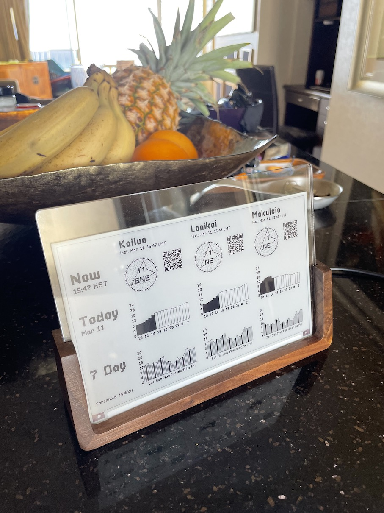
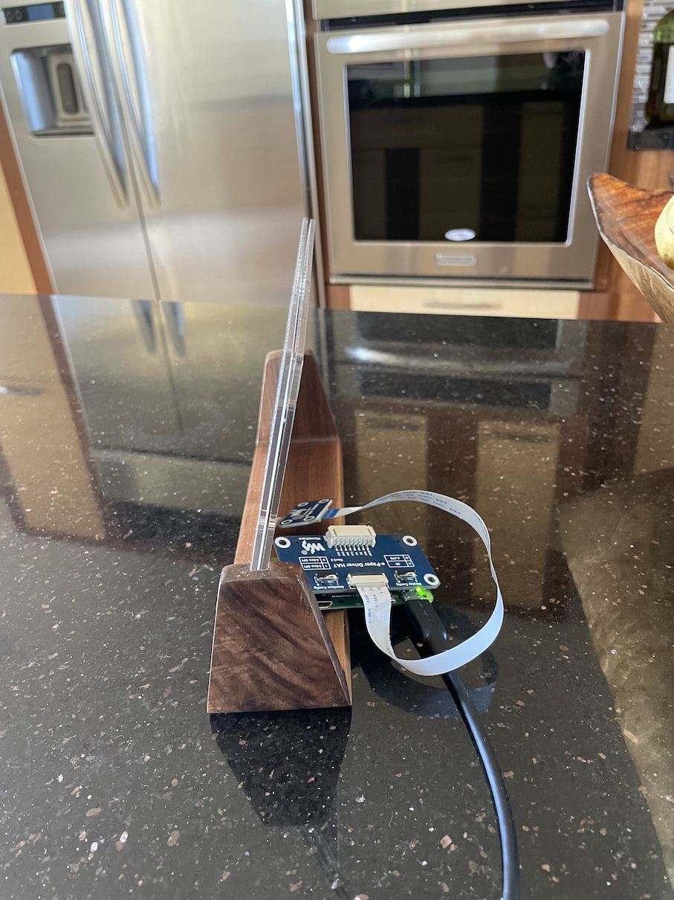

# Kiteink - Kite eInk display

Fetch wind data and display it on an e-Ink display
using a Raspberry PI.

## Inspiration

Kitesurfing only works when it's windy. It's nice to have a passive, unobstrusive
way to get a feel for how windy it will be this week, and how to plan around it.
Also, ePaper displays look sweet.

## Notes

Wind data is fetched from Weatherflow API.

It seems like using the API for personal use is ok based on [Weatherflow Terms Of Use][1],
as long as you don't sell the data or display it publicly—but IANAL so maybe you could
run afoul of the Weatherflow lawyers just using this system.

[1]: https://help.weatherflow.com/hc/en-us/articles/206504298-Terms-of-Use

## Hardware

 
 

The specific hardware used was:

- Raspberry Pi Zero
- [Waveshare 7.5 inch red+black display with ePaper Driver HAT (for GPIO)][2]
- A cool [flat USB-A charger][3]
- Simple [wood and acrylic picture frame][4]—this pretty nicely shows off the thinness of the screen.
- [3D Printed Raspberry Pi Zero case][5]
  - Direct download [the STL files model file]
  - Access the "thing" in [TinkerCad][6]

You may need to modify code for other hardware.

[2]: https://www.amazon.com/gp/product/B075YP81JR
[3]: https://www.amazon.com/dp/product/B07MNR1TKD
[4]: https://www.amazon.com/gp/product/B086Y8F55B
[5]: assets/ePaper_Hat_v1.0.stl
[6]: https://www.tinkercad.com/things/cVSj39HFrdb

## Software

The software is two python scripts which fetch data from Weatherflow, and paint
the fetched data to the ePaper screen.

The scripts are run via a cronjob with a bit of randomness built in—so they run
~20 times a day.

Once setup you should be able to power cycle the Raspberry Pi and it will "just work"
when it comes back.

### Deploy on Raspberry PI

- Setup your local machine
  - Clone this repo
  - Copy and fill in your own values for `.envrc.example` -> `.envrc`
    - `export RPI_IP="192.168.1.208"` should be the IP address of your Raspberry Pi
  - Install **direnv**. e.g., `brew install direnv` (https://direnv.net/docs/installation.html)
- Setup Raspberry Pi
  - You must have already set up your Raspberry Pi to connect to your wifi
    - Use [the Raspberry Pi imager](https://www.raspberrypi.com/software/) to install an image which knows your wifi password 
  - Enable SPI via the config interface. 
    - Connect `ssh pi@$RPI_IP`
    - Start configuration interface `sudo raspi-config`
  - Copy and fill in your own values for `configs/etc_cron.d_kiteink.example` -> `configs/etc_cron.d_kiteink`
    - Leave `WF_USERNAME`, `WF_PASSWORD` if you dont have a iKitesurf account to login to
    - `KITE_SPOT_IDS` should be a comma-separated list of Kite Spot Ids
    - You can find a kitespot ID in the URL of an ikitesurf location—like: Cabarete: https://wx.ikitesurf.com/spot/182265
  - Deploy to Raspberry Pi: `deploy/setup-rpi.sh`
    - This will do basic setup of the Raspberry Pi—you need to know your `pi` username's password to do this
  - Deploy to Raspberry Pi: `deploy/deploy.sh`
    - This will copy the relevant files from your machine to the Raspberry Pi
  - Start the cronjob `deploy/restart-cron.sh`

You can turn off the cronjob by updating the crontab manually or running `deploy/halt-cron.sh`

