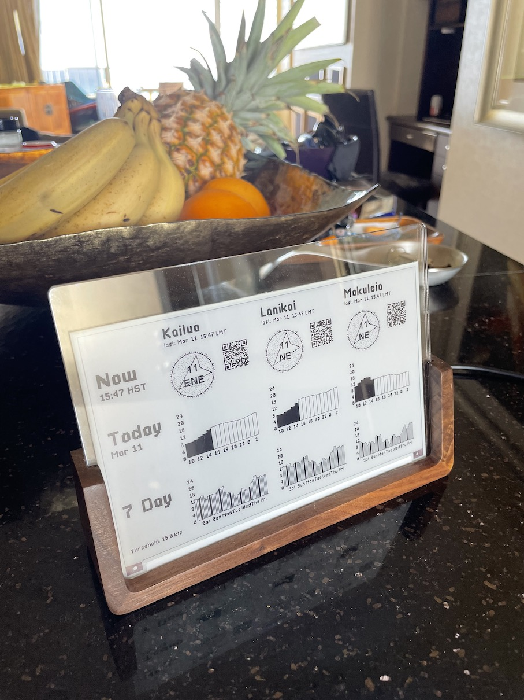
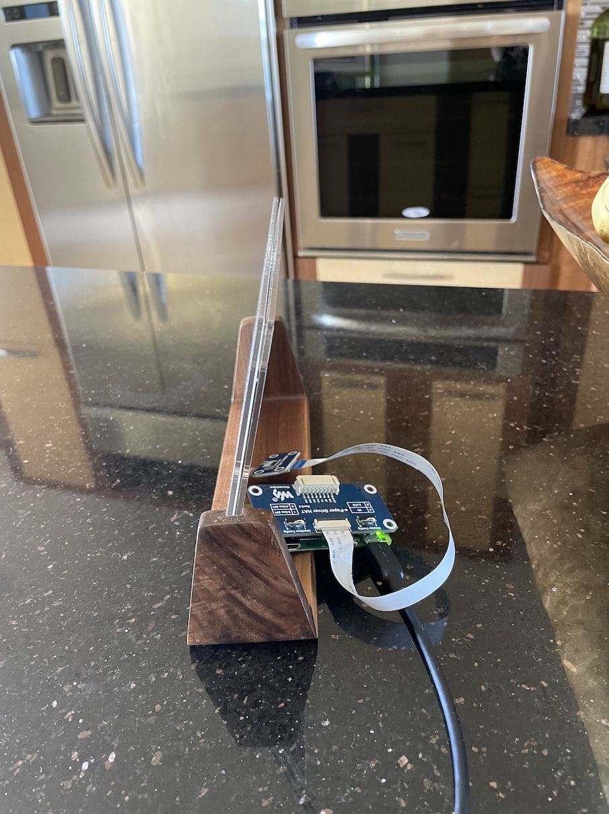

# Kiteink - Kite eInk display

Fetch wind data and display it on an e-Ink display
using a Raspberry PI.

## Inspiration

Kitesurfing only works when it's windy. It's nice to have a passive, unobstrusive
way to get a feel for how windy it will be this week, and how to plan around it.
Also, ePaper displays look sweet.

## Notes

Wind data is fetched from Weatherflow API.

It seems like using the API for personal use is ok based on [Weatherflow Terms Of Use][1],
as long as you don't sell this data or display it publicly—but IANAL so maybe you could
run afoul of the Weatherflow lawyers by doing this.

[1]: https://help.weatherflow.com/hc/en-us/articles/206504298-Terms-of-Use

## Hardware

 
 

The specific hardware used was:

- Raspberry Pi Zero
- [Waveshare 7.5 inch red+black display with ePaper Driver HAT (for GPIO)][2]
- A cool [flat USB-A charger][3]
- Simple [wood and acrylic picture frame][4]—this pretty nicely shows off the thinness of the screen.
- 3D Printed Raspberry Pi Zero case. (TBD)

You may need to modify code for other hardware.

[2]: https://www.amazon.com/gp/product/B075YP81JR
[3]: https://www.amazon.com/dp/product/B07MNR1TKD
[4]: https://www.amazon.com/gp/product/B086Y8F55B

## Software

The software is two python scripts which fetch data from Weatherflow, and paint
the fetched data to the ePaper screen.

The scripts are run via a cronjob with a bit of random

### Setup for development

- Clone repo
- Copy and fill in your own values for `.envrc.example` -> `.envrc`
  - `export RPI_IP="192.168.1.208"` should be the IP address of your RaspberryPi
- Install **direnv**. e.g., `brew install direnv` (https://direnv.net/docs/installation.html)

### Deploy on Raspberry PI

- Copy and fill in your own values for `configs/etc_cron.d_kiteink.example` -> `configs/etc_cron.d_kiteink`
- Deploy to RaspberryPi: `bash deploy/deploy.sh`
- Enable SPI via the config interface. 
  - Connect `ssh pi@$RPI_IP`
  - Start configuration interface `sudo raspi-config`
- Start the cronjob `bash deploy/restart-cron.sh`

